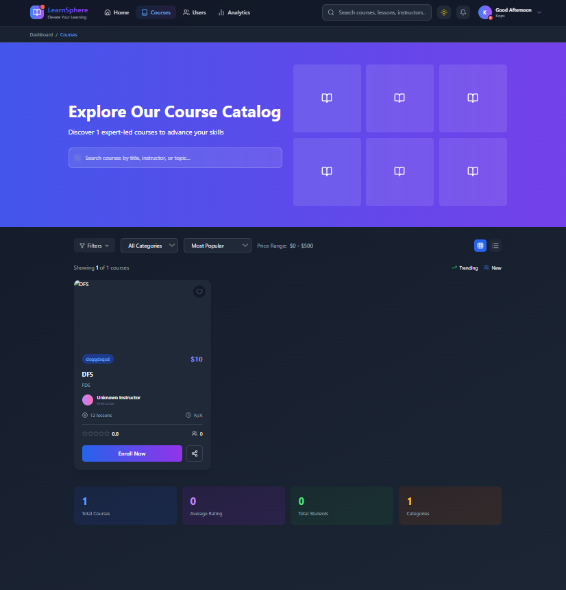
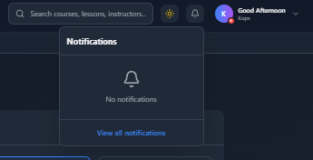
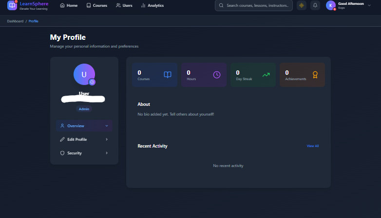
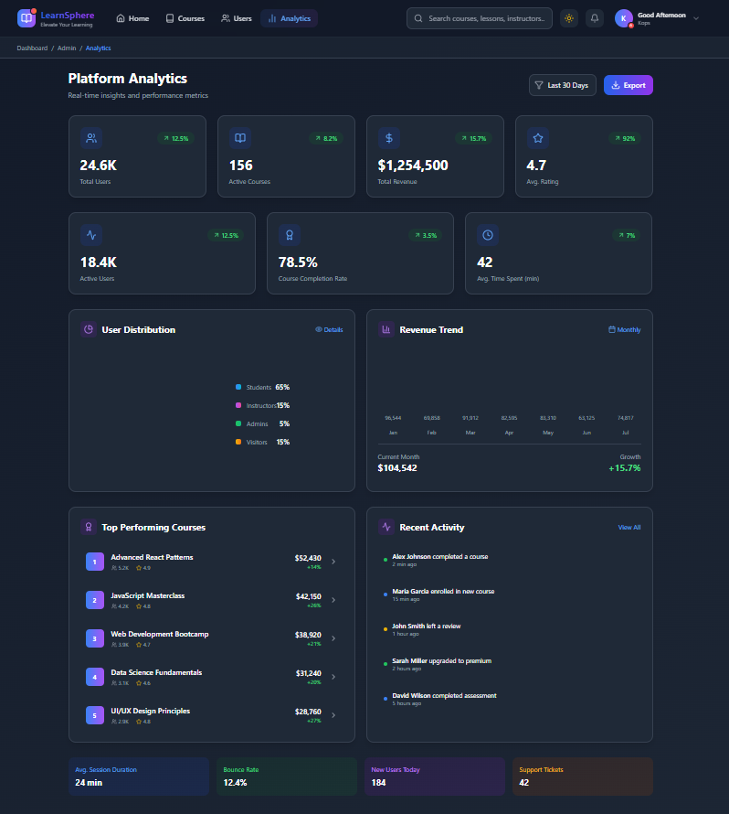
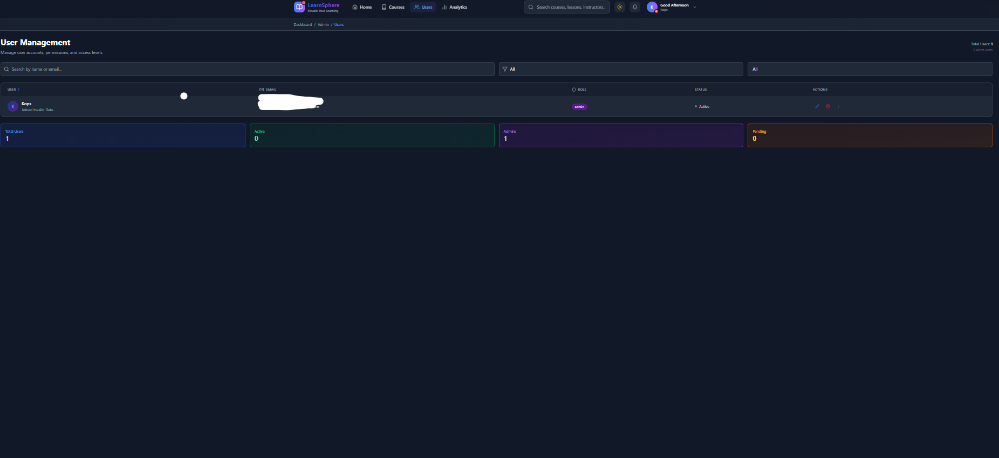
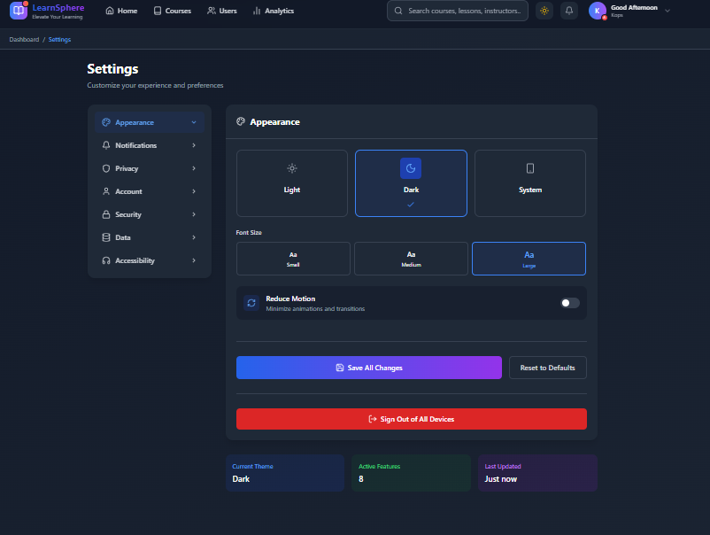

# 🎓 E-Learning Platform (LMS)

A modern, full-featured **E-Learning Platform** built with **React** that delivers an interactive learning experience for **students, teachers, and administrators**.


---

⚠️ **IMPORTANT NOTICE**  
This project is a **prototype currently under active development**.  
The **backend is not finalized** and several features may be incomplete, unstable, or subject to change.

---

## 🚀 Overview

This project is a comprehensive **Learning Management System (LMS)** designed for online education.  
It supports course creation, interactive lessons, quizzes, analytics, and role-based dashboards.

---

## ✨ Features

### 👨‍🎓 Students
- 📚 **Course Catalog** – Browse and enroll in courses  
  
- 🎥 **Interactive Lessons** – Videos & multimedia content
- 📝 **Quizzes** – Instant feedback and scoring
- 📊 **Progress Tracking** – Visual learning indicators
- 🏆 **Achievements** – Badges & certificates
- 🔔 **Notifications** – Course announcements  
  
- 👤 **Profile Management**  
  

---

### 👩‍🏫 Teachers
- 🛠 **Course Management** – Create & update courses
- 📤 **Content Upload** – Videos, PDFs, and materials
- 📈 **Analytics Dashboard** – Student engagement & performance  
  
- 👥 **Class Management** – Track learners
- 🧪 **Assessment Tools** – Create and grade quizzes

---

### 🛡 Administrators
- 👤 **User Management**  
  
- 🗂 **Content Moderation**
- 📊 **Platform Analytics**
- ⚙️ **System Settings**  
  

---

## 🧰 Tech Stack

| Layer | Technology |
|------|-----------|
| **Frontend** | React 19 |
| **Styling** | Tailwind CSS, PostCSS |
| **Routing** | React Router DOM |
| **State** | Context API, TanStack React Query |
| **Backend** | Firebase |
| **Charts** | Chart.js, Recharts |
| **Animations** | Framer Motion |
| **Icons** | Lucide React, React Icons |
| **Notifications** | React Hot Toast |
| **Utilities** | Date-fns, UUID |

---

## 📁 Project Structure
src/
├── components/
│ ├── admin/ # Admin dashboard
│ ├── auth/ # Authentication
│ ├── courses/ # Courses & lessons
│ ├── dashboard/ # Dashboards
│ ├── error/ # Error pages
│ ├── home/ # Landing pages
│ ├── layout/ # Header, Footer, Sidebar
│ ├── teacher/ # Teacher features
│ └── ui/ # Reusable UI components
├── context/ # Auth & Theme providers
├── services/ # Firebase services
├── App.js
└── index.js
---

## ⚙️ Getting Started

### Prerequisites
- Node.js **v14+**
- npm or yarn

### Installation

```bash
git clone <repository-url>
cd e-learning
npm install
```
## © Copyright & Usage Permission

© 2026 — All Rights Reserved

This project is an original work and is protected under international copyright laws.

Any use of this project — including copying, modifying, distributing, deploying, or using it for commercial or non-commercial purposes — **requires prior explicit permission from the author**.

👉 **If you need to use this project in any form, you must ask for my permission first.**

This repository is provided **for viewing and evaluation purposes only**.  
The project is a **prototype under active development**, and the **backend is still under development and not production-ready**.

Unauthorized use is strictly prohibited.

---